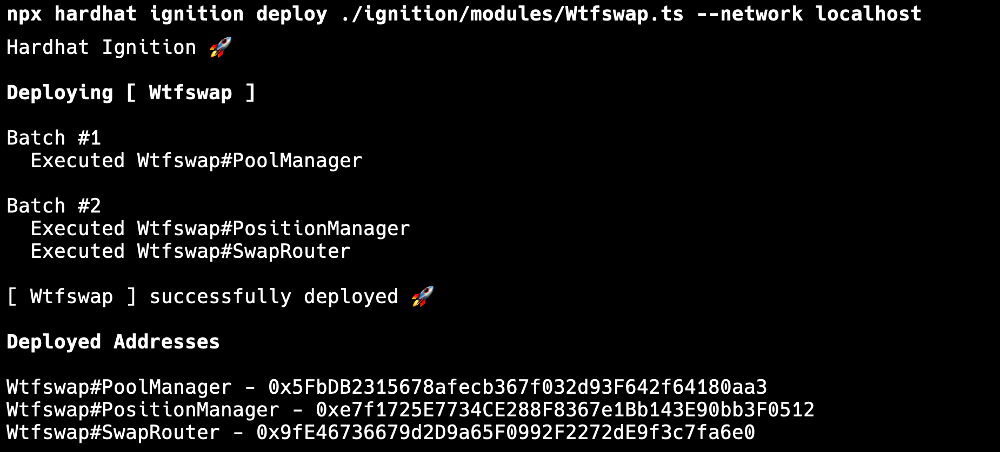

这一讲我们将在本地开发环境中初始化合约，正式启动开发。

---

## 初始化合约

Wtfswap 的合约开发我们继续基于之前在[《合约本地开发和测试环境》](../14_LocalDev/readme.md) 和[《使用 Wagmi CLI 调试本地合约》](../15_WagmiCli/)中搭建的本地开发环境开发，如果你还没有搭建过，请基于那一讲课程搭建。

我们结合在上一讲中接口的设计，我们新增一个 `contract/wtfswap` 的目录按照如下结构初始化合约：

```
- contracts
  - wtfswap
    - interfaces
      - IFactory.sol
      - IPool.sol
      - IPoolManager.sol
      - IPositionManager.sol
      - ISwapRouter.sol
    - Factory.sol
    - Pool.sol
    - PoolManager.sol
    - PositionManager.sol
    - SwapRouter.sol
```

每一个合约文件我们都对应初始化好一个基础的架子，以 `Pool.sol` 为例：

```solidity
// SPDX-License-Identifier: GPL-2.0-or-later
pragma solidity ^0.8.24;

import "./interfaces/IPool.sol";
import "./interfaces/IFactory.sol";

contract Pool is IPool {
    /// @inheritdoc IPool
    address public immutable override factory;
    /// @inheritdoc IPool
    address public immutable override token0;
    /// @inheritdoc IPool
    address public immutable override token1;
    /// @inheritdoc IPool
    uint24 public immutable override fee;
    /// @inheritdoc IPool
    int24 public immutable override tickLower;
    /// @inheritdoc IPool
    int24 public immutable override tickUpper;

    /// @inheritdoc IPool
    uint160 public override sqrtPriceX96;
    /// @inheritdoc IPool
    int24 public override tick;
    /// @inheritdoc IPool
    uint128 public override liquidity;

    // 用一个 mapping 来存放所有 Position 的信息
    mapping(address => Position) public positions;

    constructor() {
        // constructor 中初始化 immutable 的常量
        // Factory 创建 Pool 时会通 new Pool{salt: salt}() 的方式创建 Pool 合约，通过 salt 指定 Pool 的地址，这样其他地方也可以推算出 Pool 的地址
        // 参数通过读取 Factory 合约的 parameters 获取
        // 不通过构造函数传入，因为 CREATE2 会根据 initcode 计算出新地址（new_address = hash(0xFF, sender, salt, bytecode)），带上参数就不能计算出稳定的地址了
        (factory, token0, token1, tickLower, tickUpper, fee) = IFactory(
            msg.sender
        ).parameters();
    }

    function initialize(uint160 sqrtPriceX96_) external override {
        // 初始化 Pool 的 sqrtPriceX96
        sqrtPriceX96 = sqrtPriceX96_;
    }

    function mint(
        address recipient,
        uint128 amount,
        bytes calldata data
    ) external override returns (uint256 amount0, uint256 amount1) {
        // 基于 amount 计算出当前需要多少 amount0 和 amount1
        // TODO 当前先写个假的
        (amount0, amount1) = (amount / 2, amount / 2);
        // 把流动性记录到对应的 position 中
        positions[recipient].liquidity += amount;
        // 回调 mintCallback
        IMintCallback(recipient).mintCallback(amount0, amount1, data);
        // TODO 检查钱到位了没有，如果到位了对应修改相关信息
    }

    function collect(
        address recipient
    ) external override returns (uint128 amount0, uint128 amount1) {
        // 获取当前用户的 position，TODO recipient 应该改为 msg.sender
        Position storage position = positions[recipient];
        // TODO 把钱退给用户 recipient
        // 修改 position 中的信息
        position.tokensOwed0 -= amount0;
        position.tokensOwed1 -= amount1;
    }

    function burn(
        uint128 amount
    ) external override returns (uint256 amount0, uint256 amount1) {
        // 修改 positions 中的信息
        positions[msg.sender].liquidity -= amount;
        // 获取燃烧后的 amount0 和 amount1
        // TODO 当前先写个假的
        (amount0, amount1) = (amount / 2, amount / 2);
        positions[msg.sender].tokensOwed0 += amount0;
        positions[msg.sender].tokensOwed1 += amount1;
    }

    function swap(
        address recipient,
        bool zeroForOne,
        int256 amountSpecified,
        uint160 sqrtPriceLimitX96,
        bytes calldata data
    ) external override returns (int256 amount0, int256 amount1) {}
}
```

其它合约对应的代码可以参考 [code](./code/) 查看。

初始化完成后执行 `npx hardhat compile` 编译合约，合约编译完成后你可以在 `demo-contract/artifacts` 目录下看到编译后的产物，里面包含了合约的 ABI 等信息。

然后进入到前端项目 `demo` 目录，执行 `npx wagmi generate` 生成合约的 React Hooks（具体可以参考[《使用 Wagmi CLI 调试本地合约》](../15_WagmiCli/)），这样我们就可以在前端代码中方便的调用合约了。

## 初始化部署脚本

结合之前[《合约本地开发和测试环境》](../14_LocalDev/readme.md)教程的内容，我们新建 `ignition/modules/Wtfswap.ts` 文件，编写部署脚本：

```ts
import { buildModule } from "@nomicfoundation/hardhat-ignition/modules";

const WtfswapModule = buildModule("Wtfswap", (m) => {
  const poolManager = m.contract("PoolManager");
  const swapRouter = m.contract("SwapRouter");
  const positionManager = m.contract("PositionManager");

  return { pool, factory, poolManager, swapRouter, positionManager };
});

export default WtfswapModule;
```

需要注意的是，`Factory` 合约和 `Pool` 合约不需要单独部署，`Factory` 是由 `PoolManager` 继承，部署 `PoolManager` 即可，而 `Pool` 合约则是应该在链上由 `PoolManager` 部署。

通过 `npx hardhat node` 启动本地的测试链。

然后执行 `npx hardhat ignition deploy ./ignition/modules/Wtfswap.ts --network localhost` 来部署合约，这个时候你会发现报如下的错误：

```
[ Wtfswap ] validation failed ⛔

The module contains futures that would fail to execute:

Wtfswap#SwapRouter:
 - IGN703: The constructor of the contract 'SwapRouter' expects 1 arguments but 0 were given

Wtfswap#PositionManager:
 - IGN703: The constructor of the contract 'PositionManager' expects 1 arguments but 0 were given

Update the invalid futures and rerun the deployment.
```

这是因为合约 `SwapRouter` 和 `PositionManager` 的构造函数需要以 `PoolManager` 合约地址为参数。我们继续修改 `ignition/modules/Wtfswap.ts`，补充相关逻辑。

```diff
import { buildModule } from "@nomicfoundation/hardhat-ignition/modules";

const WtfswapModule = buildModule("Wtfswap", (m) => {
  const poolManager = m.contract("PoolManager");
-  const swapRouter = m.contract("SwapRouter");
-  const positionManager = m.contract("PositionManager");
+  const swapRouter = m.contract("SwapRouter", [poolManager]);
+  const positionManager = m.contract("PositionManager", [poolManager]);

  return { poolManager, swapRouter, positionManager };
});

export default WtfswapModule;
```

如上面代码所示，我们将 `PoolManager` 合约作为参数来部署 `SwapRouter` 和 `PositionManager` 合约，具体可以参考 [Hardhat 官方文档](https://hardhat.org/ignition/docs/guides/creating-modules#deploying-a-contract)。

然后重新执行上面的部署命令，如果顺利你可以看到如下结果：



接下来，从下一章开始，我们就可以愉快的进行开发了。🎉
